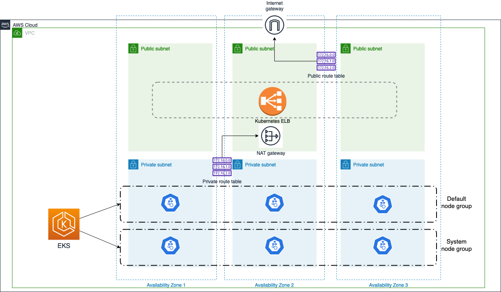

# EKS Cluster

Terraform manifests for deploying an EKS cluster, on a VPC, with three public subnets and three private subnets.
The cluster uses 2 EKS managed node groups:
- **default**: a default node group for everything
- **system**: a node group dedicated for platform components

It also installs some addons for a functional kubernetes cluster:

- Ingress Controller (Nginx)

- Cert Manager

- ExternalDNS addon

To test the cluster, an app (podinfo) is deployed to make sure the cluster and the different addons (Ingress Controller, CertManager and ExternalDNS) are working as expected.

Optionally, [kube-cert-acm](https://github.com/mstiri/kube-cert-acm) can be enabled and installed on the cluster.
